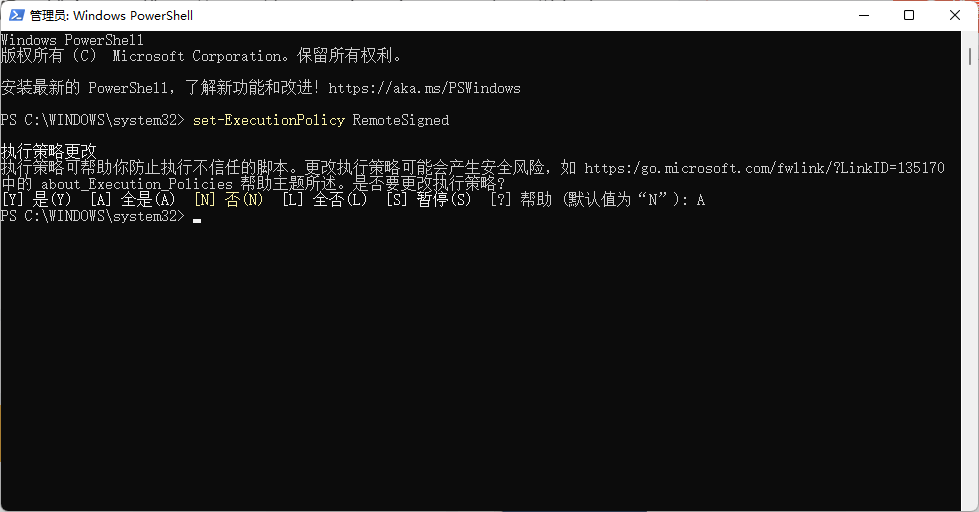
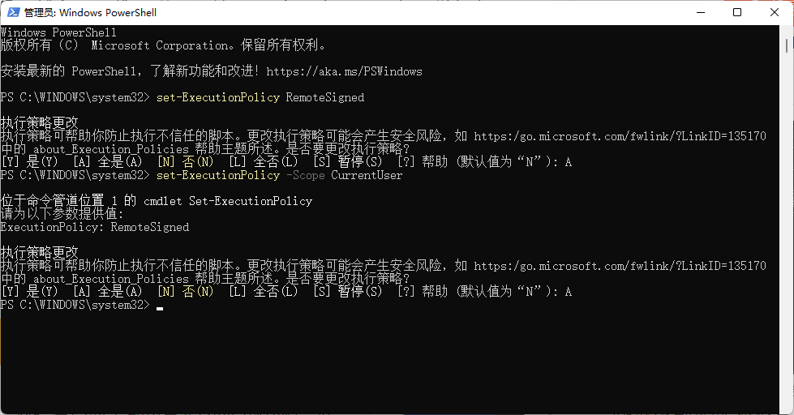

> powershell 内 git 不是内部或外部命令 , 但是若是用管理员身份打开则不会报错
>
> 解决办法 ：
>
> - 用管理员权限打开 powershell
>
> - 输入命令 `get-ExecutionPolicy`
>   若是Restricted , 则说明权限是禁止的 , 那么输入 `set-ExecutionPolicy RemoteSigned`
>   选 A
>
> - 
>
> - 若是`get-ExecutionPolicy`是RemoteSigned,但还是不行 , 那么可能是当初设置path的时候,设置的是用户环境变量
>   需要执行 `set-ExecutionPolicy -Scope CurrentUser `
>
>   输入 RemoteSigned
>
>   选 A
>
>   
>
>   
>
> 
>
>  